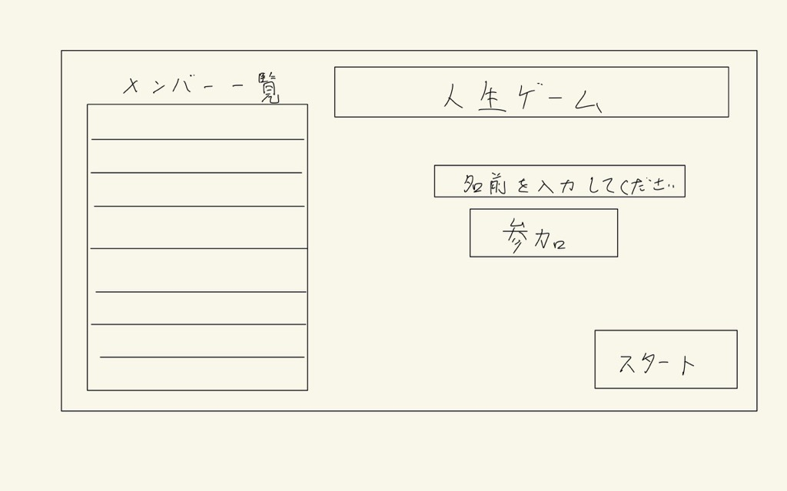

# オブジェクト指向プログラミングおよび演習 第12回進捗レポート

## 作成者情報

- 学籍番号：K24045
- 氏名：加藤　璃空
- グループ：10
- メンバー
    - K24118 西田　拓矢（チームリーダー）
    - K24005 天野　椋祐
    - K24045 加藤　璃空
    - K24047 鎌田　隼澄
    - K24145 横井　優宇

## 仕様

- 人生ゲーム
- １０人まで遊ぶことが可能。
- マップを自由にピンチイン・アウト可能。
- 他プレイヤーの情報を閲覧可能。

## アプリ完成イメージ

- ロビー画面
    - 
- ゲーム画面
    - 

## 作業分担

- マップ用画像・イベント案作成（担当：K24047 鎌田　隼澄）
- フロントエンド担当（主担当：K24005 天野　椋祐）
- バックエンド担当（主担当：K24045 加藤　璃空,　K24145 横井　優宇）

## 作業報告
- プルリクエストURL：https://github.com/OOP2-2025-final-G10/BoardGameApp/pull/2
    - ゲームで使うオブジェクトを設計し作成しました
    - 株価を表示するためのプログラムを作成しました
    - 
- 調べ物
    - バックエンドの仕事の分け方をGENEMIに聞いた
    - 株価をどう表示すればいいかGENEMIに聞いた

## グループ内でお世話になった人2〜3名を理由とともに挙げる

- 同じバックエンド担当である横井君に、私が作ったオブジェクトの修正と実装を手伝ってもらいました。(K24145 横井　優宇)
- 調べ物を手伝ってくれた(K24145 横井　優宇)

## 振り返り（感想含む）と次回までの作業予定

- バックエンドの仕事を二人でやるのは今回で二回目なので、ちゃんと意見のすり合わせをすることができました
- 次回はミスの調査、修正、全体のサポートをしたいです